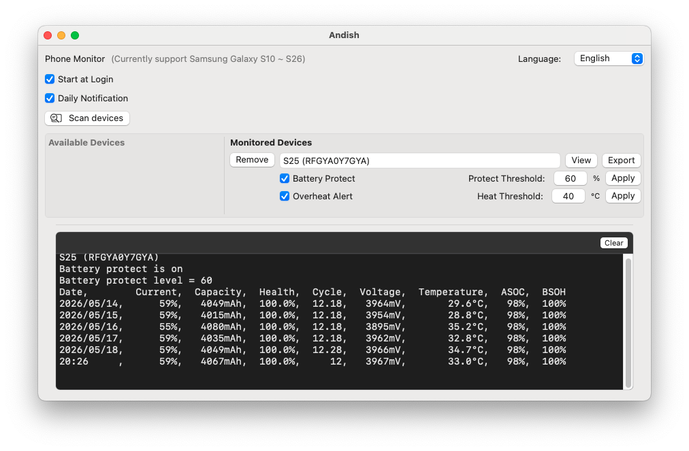

<p align="center">
    
</p>

<h1 align="center">Andish</h1>

<p align="center">
  <b>Remote Android Phone Monitoring for Mac</b><br>
  Automatically logs Android battery health, temperature, and cycle counts to your Mac daily.
</p>

<p align="center">
  English | <a href="README_TW.md">中文</a>
</p>

---

### 🌍 Preview
**Andish** is a free macOS utility that leverages Wi-Fi ADB technology to automatically log Android phone battery metrics (such as battery health) to your Mac on a daily basis. Additionally, it features high-temperature alerts and allows you to set a battery charge limit anywhere between 20% and 100% to protect your device.

> ⚠️ **Current Support:** Samsung Galaxy S10 ~ S26 series devices only.

[]()

## 🌟 Core Features
* **Remote Monitoring & Scheduled Logging:** Uses Wi-Fi ADB to remotely fetch Android phone analytics, tracking and recording daily statistics including battery health, cycle count, temperature, voltage, ASOC, and BSOH.
* **Charge Limiter:** Set a custom charging ceiling (ranging from 20% to 100%) to significantly prolong your phone's battery lifespan.
* **Overheating Alerts:** Define a critical temperature threshold; your Mac will trigger voice announcements and system notifications if the phone overheats.
* **Intuitive Native GUI:** Clean and lightweight native Swift interface for effortless monitoring and configuration.
* **Apple Notarized:** Fully notarized by Apple, ensuring maximum security, compatibility, and seamless execution outside the sandbox.

## 🌻 Requirements
- **Mac:** macOS 13+ (Ventura or later)
- **Android Phone:** Samsung Galaxy S10 ~ S26 series only

## 💎 Prerequisites
Andish communicates with and controls your Android device via Wi-Fi ADB. Please complete the following Wi-Fi ADB setup steps before installing the app:

#### 🛠️ Step 1. Mac Side: Install ADB Tools
Open your Mac Terminal and run the following command to install the Android platform tools:
```bash
brew install --cask android-platform-tools
```

#### 📱 Step 2. Phone Side: Enable Developer Options
1. Go to **Settings > About phone > Software information**, and tap **"Build number"** repeatedly until it says "Developer mode has been enabled."
2. Go back to **Settings > Developer options** (now visible at the bottom):
   * Find and toggle on **"Wireless debugging"** ➔ Check "Always allow on this network" and tap "Allow" in the pop-up window.
   * Tap into the "Wireless debugging" menu ➔ Tap **"Pair device with pairing code"**. Your phone will display an **IP address & Port** along with a **Wi-Fi pairing code** (keep this screen open; you will need it for Step 3).
   * Toggle on **"Disable adb authorization timeout"** (*Crucial: If left off, your phone will revoke authorization every 7 days*).

#### 💻 Step 3. Mac Side: Complete Initial Pairing
1. Open your Mac Terminal and execute the pairing command (replace with the actual IP and Port shown on your phone):
   ```bash
   adb pair 192.168.1.28:45329
   ```
2. When prompted for the pairing code in the Terminal, enter the **6-digit Wi-Fi pairing code** displayed on your phone.
3. Once successfully paired, verify the connection by running:
   ```bash
   adb devices
   ```
   If successful, your device serial number will appear in the list:
   ```text
   List of devices attached
   adb-RF2M51TT2RX-odmDbe._adb-tls-connect._tcp  device
   ```

---

## ⚙️ Installation

Quickly install Andish via Homebrew Cask:
```bash
brew install --cask js4jiang5/andish/andish
```
### 💡 Looking for a complete Mac + Android Battery Solution?
If you want to optimize your Mac's battery health alongside your Android device, check out my BattOpt project —— **[BattOpt](https://github.com/js4jiang5/BattOpt)**!

**All core features of Andish (remote monitoring, charge limiter, and overheat alerts) are fully integrated into BattOpt. In addition, BattOpt can monitor multiple Android devices**
If you prefer a single, unified menu-bar utility that safeguards both your MacBook and your Android phone simultaneously, we highly recommend installing the full-featured BattOpt ecosystem. Please consider visiting the **[BattOpt Repository](https://github.com/js4jiang5/BattOpt)** and giving it a **Star ⭐️** to support my continuous development!

## 🚀 Getting Started

### 1. Launch Andish.app
Upon the first run, a setup window will guide you through initialization. Please make sure to:
* **Allow Background Execution** (necessary for the Launch Agent background daemon to fetch data on schedule).
* **Allow System Notifications**, and change the notification banner style to **"Alerts"** in macOS System Settings to ensure overheating voice alerts trigger properly.

### 2. Using the Menu Bar Icon
* Click the Andish icon in your menu bar and select **"Dashboard"** to bring up the main window.
* Click **"Scan Devices"** to automatically discover currently connected ADB devices.
* Click **"Add"** to include the discovered phone in your daily monitoring list.
* Click **"View"** to dynamically print the current and last 5 entries of battery records in the built-in terminal area.
* Click **"Export"** to save the complete historical battery logs as a text file to your `~/Downloads` directory.

---

## 🔁 Automation Setup (Post-Installation)
Due to Android security policies, **"Wireless debugging" automatically turns off** whenever the phone disconnects from Wi-Fi. To ensure Andish seamlessly tracks your phone data every time you return home and connect to Wi-Fi, we highly recommend setting up the following automation:

1. **Install LADB on your phone:** LADB is a free, open-source local ADB shell tool (available on Google Play as a paid app if you prefer to skip manual compilation).
2. **Configure Samsung "Modes and Routines":**
   * Go to **Settings > Modes and Routines > Routines > Add Routine**.
   * **IF:** `Wi-Fi network connected` ➔ Choose your home Wi-Fi network.
   * **THEN:** `Open an app or execute an app action` ➔ Select **LADB**.
3. **No worries about LADB background leaks:**
   After triggering Wireless Debugging via LADB, the app usually needs to be closed to ensure the routine triggers successfully next time. **Andish handles this for you!** If Andish detects that LADB is left open on your phone, the Mac daemon will remotely terminate LADB on the device to optimize battery and performance.

---

## ⭐️ Star the Repository!
If Andish has helped you manage and monitor your Android device on macOS, please consider giving this project a **Star ⭐️** at the top of the GitHub page!

Homebrew's official core repository (Homebrew-Cask) enforces strict community engagement and star thresholds for public inclusion. Your star is the most powerful driving force to help us get Andish approved for the official repo, which will simplify the installation command down from `brew install --cask js4jiang5/...` to just a clean **`brew install --cask andish`**. Thank you for your support!

---

## 🤝 Contributing
Contributions, issue reports, and feature requests are welcome! Feel free to check the [Issues Page](https://github.com/js4jiang5/Andish/issues) to join the discussion.

## 📜 License
This project is licensed under the [MIT](LICENSE) License.
> *Note: The Andish brand name, logo, and application icons are proprietary assets and all rights are reserved.*