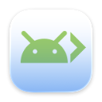
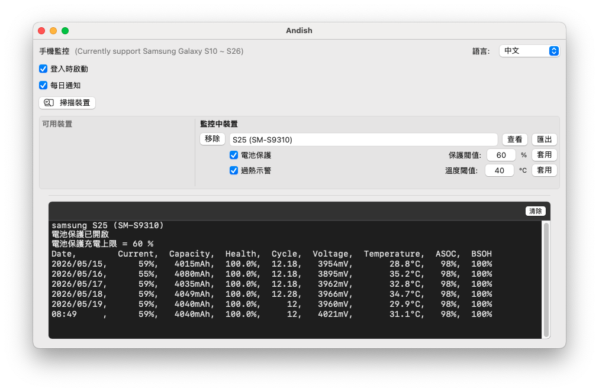

<p align="center">
    
</p>

<h1 align="center">Andish</h1>

<p align="center">
  <b>Mac 遠端監控安卓手機</b><br>
  每日自動記錄安卓手機電池健康度、溫度、循環次數等資訊到 Mac
</p>

<p align="center">
  <a href="README.md">English</a> | 中文
</p>

---

### 🌍 介面預覽
**Andish** 是一款免費的 Mac 工具，透過 Wi-Fi ADB 技術，每日自動記錄安卓手機的電池資訊（如電池健康度）至 Mac。此外，它還提供手機過熱示警功能，並支援設定手機電池保護充電上限（20% - 100%）。

> ⚠️ **目前僅支援：** Samsung Galaxy S10 ~ S26 系列機型。

[]()

## 🌟 核心功能
* **遠端監控定時記錄：** 透過 Wi-Fi ADB 技術遠端讀取安卓手機資訊，每日追蹤並完整記錄電池健康度、循環次數、溫度、電壓、ASOC、BSOH。
* **充電上限限制：** 自由設定手機充電上限（範圍 20% - 100%），延長電池壽命。
* **過熱即時示警：** 自訂手機電池過熱臨界溫度，超過時 Mac 將主動發出語音示警與系統通知。
* **直覺原生 GUI：** 簡潔俐落的原生 Swift 介面，方便隨時監控與設定。
* **Apple 官方公證：** 已通過 Apple 安全性與相容性驗證，無沙盒安全隱憂，安心執行。

## 🌻 硬體需求
- **Mac:** macOS 13+ (Ventura 或更新版本)
- **安卓手機:** 目前僅支援 Samsung Galaxy S10 ~ S26

## 💎 前置作業
Andish 透過 Wi-Fi ADB 讀取與控制安卓手機，安裝前請務必依序設定好 Wi-Fi ADB：

#### 🛠️ Step 1. Mac 端：安裝 ADB 工具
打開 Mac 終端機（Terminal）執行以下指令安裝：
```bash
brew install --cask android-platform-tools
```

#### 📱 Step 2. 手機端：啟用開發人員選項
1. 進入手機 **設定 > 關於手機 > 軟體資訊**，連續點擊 **「版本號碼」** 直到顯示「已啟用開發人員模式」。
2. 返回 **設定 > 最下方新增的「開發人員選項」**：
   * 尋找並開啟 **「無線偵錯」** ➔ 在彈出視窗中勾選「一律允許在此網路」並選擇「允許」。
   * 點選進入「無線偵錯」 ➔ 點擊 **「使用配對碼配對裝置」**。手機畫面會顯示 **IP 位址和通訊埠** 以及 **Wi-Fi 配對碼**（Step 3 會用到，請先別關閉視窗）。
   * 開啟 **「停用 ADB 授權逾時」** 開關（*重要：若未開啟，手機每 7 天就會強制重新授權*）。

#### 💻 Step 3. Mac 端：完成首次配對
1. 打開 Mac 終端機，執行配對指令（請替換為你手機上顯示的實際 IP 與 Port）：
   ```bash
   adb pair 192.168.1.28:45329
   ```
2. 當終端機提示輸入配對碼時，輸入手機畫面上顯示的 **6 位數 Wi-Fi 配對碼**。
3. 配對成功後，執行以下指令驗證：
   ```bash
   adb devices
   ```
   若出現連線成功的設備序號，即代表大功告成：
   ```text
   List of devices attached
   adb-RF2M51TT2RX-odmDbe._adb-tls-connect._tcp  device
   ```

---

## ⚙️ 安裝 Andish.app

透過 Homebrew Cask 快速安裝：
```bash
brew install --cask js4jiang5/andish/andish
```
### 💡 想要更全面的 Mac + Android 電池優化嗎？
如果您不只希望監控安卓手機，還想同時保護您的 Mac 電池健康，歡迎參考我的另一個專案 —— **[BattOpt](https://github.com/js4jiang5/BattOpt)**！

**Andish 的所有核心功能（遠端監控、充電上限、過熱示警）已完整內建於 BattOpt 中，且可監控多台手機。** 如果您希望在同一個選單列中完美兼顧「Mac 筆電優化」與「安卓雙棲監控」，歡迎直接安裝完全體的 BattOpt，也請不吝前往 **[BattOpt 倉庫](https://github.com/js4jiang5/BattOpt)** 順手點擊一顆 **Star ⭐️**，您的支持是我持續維護整個電池優化生態系的最高動力！

## 🚀 操作說明

### 1. 首次啟動 Andish.app
首次執行時會跳出初始化設定視窗，請依序：
* **允許背景執行**（以便 Launch Agent 守護進程能定時背景讀取資訊）。
* **允許系統通知**，並建議至 Mac 系統設定將通知樣式改為 **「提示」**（Alert），確保過熱語音能順利播報。

### 2. 使用選單列（Menubar Icon）
* 點擊選單列的 Andish 圖示，選取 **「儀表板」** 開啟主視窗。
* 點擊 **「掃描裝置」**，系統會自動偵測當前已連線的 ADB 裝置。
* 點擊 **「加入」** 將手機納入每日監控清單。
* 點擊 **「查看」**，下方終端機區域會動態印出當前及過去 5 筆的手機電池數據。
* 點擊 **「匯出」**，可將完整的歷史電池日誌（Log）匯出至使用者的 `~/Downloads` 目錄。

---

## 🔁 自動化優化（後置作業）
Android 系統的保護機制會在 Wi-Fi 斷線時**自動關閉「無線偵錯」**。為了確保每次回家連上 Wi-Fi 時 Andish 都能無縫持續讀取手機資訊，強烈建議設定以下自動化行程：

1. **手機安裝 LADB**：LADB 是免費開源軟體（亦可直接在 Google Play 購買付費版省去編譯時間）。
2. **設定三星「日常行程」**：
   * 進入手機 **設定 > 模式與日常行程 > 日常行程 > 新增**。
   * **如果：** `Wi-Fi 網路已連接` ➔ 選擇「家中的 Wi-Fi」。
   * **則：** `開啟應用程式或執行應用程式動作` ➔ 選擇 **LADB**。
3. **免擔心 LADB 殘留：**
   透過 LADB 背景重啟無線偵錯後，通常需要手動關閉它以確保下次日常行程能順利觸發。**這點 Andish 已經幫你考慮到了！** 只要 Andish 偵測到手機上的 LADB 忘記關閉，Mac 端會自動遠端發送指令將手機端的 LADB 關閉，維持手機省電與流暢。

---

## ⭐️ 點亮您的 Star！
如果 Andish 確實幫您解決了安卓手機在 Mac 上的監控痛點，歡迎在 GitHub 頂部幫忙點擊一顆 **Star ⭐️**！

由於 Homebrew 官方倉庫（Homebrew-Cask）對收錄軟體的社群關注度與 Star 數有著嚴格的門檻指標，您的每一顆 Star，都將成為未來 Andish 成功申請併入官方倉庫、簡化一鍵安裝指令（從 `brew install --cask js4jiang5/...` 精簡為 `brew install --cask andish`）的最關鍵推手。感謝您的支持！

---

## 🤝 參與貢獻
歡迎任何形式的貢獻、問題回報（Issues）或新功能建議！請隨時至 [Issues 頁面](https://github.com/js4jiang5/Andish/issues) 提出討論。

## 📜 授權協議
本專案採用 [MIT](LICENSE) 授權協議。
> *備註：Andish 品牌名稱、商標與軟體圖示為專有資產，保留所有權利。*